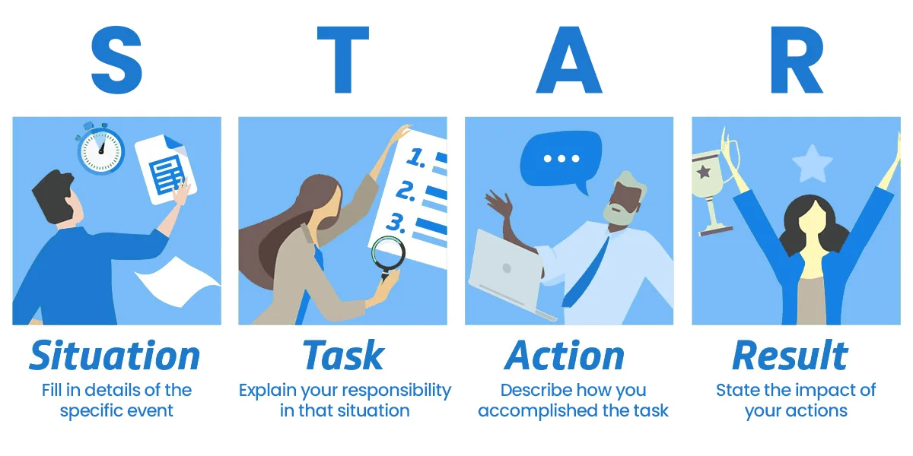
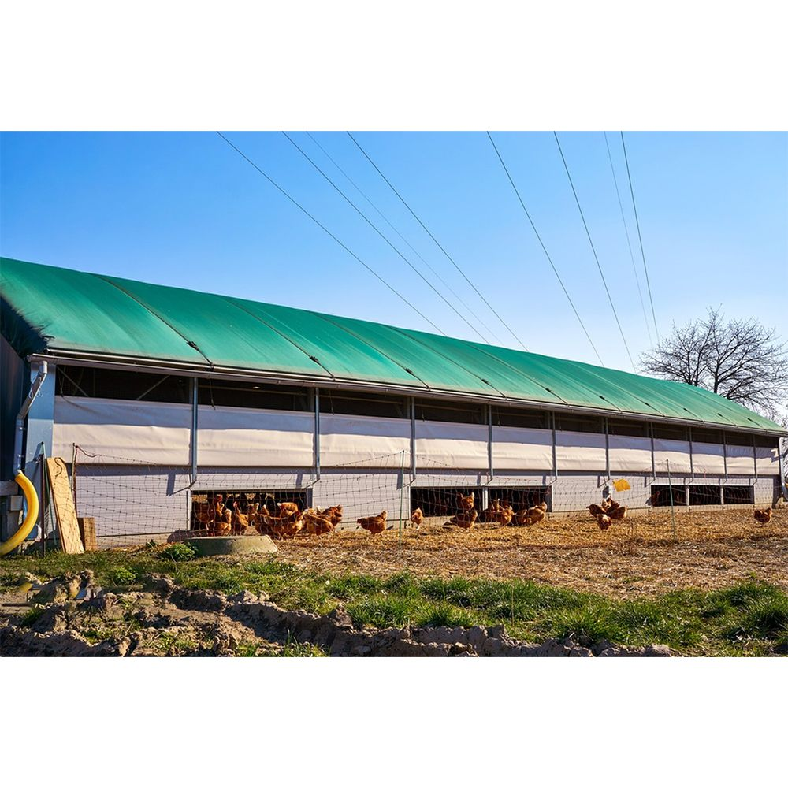

<h2>The Amazon Leadership Principle: Earn Trust<h2> 

-Leaders listen attentively, speak candidly, and treat others respectfully. 
-They are vocally self-critical, even when doing so is awkward or embarrassing. 
-Leaders do not believe their or their team’s body odor smells of perfume. 
-They benchmark themselves and their teams against the best.

**SITUATION**

**Situation:**
In my role as a Product | Project Manager, I was tasked with improving livestock production efficiency. The company had been experiencing challenges in meeting quality standards, leading to concerns from key stakeholders about the sustainability of operations and staff retention. Trust within the team and among stakeholders was eroding due to inconsistencies in the production process and unclear communication.

**Task:**
I needed to rebuild trust by improving transparency in communication, optimizing production processes, and ensuring that the entire team was aligned with our goals. My task was to deliver tangible improvements in quality and efficiency, while also fostering a positive work environment to boost staff morale and retention.

**Action:**
To rebuild trust, I took several steps:

Clear Communication: I established regular meetings with both the team and stakeholders, providing them with clear, data-driven updates on production performance and project progress. I ensured that I was available to address concerns and provide honest feedback on our challenges and how we were resolving them.
Process Optimization: I implemented new quality control measures and feeding techniques, closely collaborating with the staff to ensure that everyone understood their roles and the importance of adhering to the new processes.
Team Empowerment: I worked to build a supportive work environment by fostering collaboration and promoting an open-door policy, allowing team members to voice their concerns and share ideas on how we could further improve the production process.
**Result:**
Within a few months, the company saw a 20% increase in product quality and a 30% gain in efficiency. Stakeholders were pleased with the improvements, and the team became more motivated, resulting in a significant boost in employee retention. Through clear communication, process improvements, and team empowerment, I successfully regained the trust of both stakeholders and team members, which led to the project's overall success.

