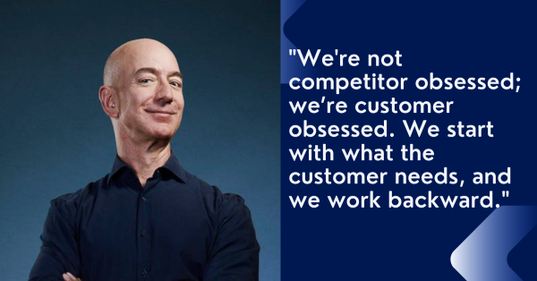

# Customer Obsession 

#### Situation:
As a shopkeeper in a busy neighborhood market, I noticed a decline in the number of regular customers visiting the store. Many customers mentioned in passing that they were going to bigger stores due to better prices and more variety, and warranty. This was concerning, as my shop had always been a community favorite. I knew I had to improve the customer experience and find ways to win them back.

#### Task:
My primary goal was to rebuild trust and customer loyalty by understanding their needs and preferences. This meant going beyond just selling products – I needed to provide a personalized and welcoming experience that would set my shop apart from the larger competitors.

#### Action:
I started by conducting informal surveys, talking to my customers during their visits to understand what they valued most. Many of them expressed a need for more personalized service, better stock of their favorite items, and some discounts for loyal customers. Based on this feedback, I implemented several changes:

Personalized Stocking: I began stocking products that were requested most frequently by regular customers, even if they were not the fastest-selling items. This showed that I was listening to their needs.

Customer Loyalty Program: I created a simple loyalty program where customers could earn points for each purchase, which could later be redeemed for discounts or special items.

Enhanced Customer Service: I trained my staff to greet customers by name whenever possible and provide personalized recommendations based on their previous purchases.

Community Engagement: I organized small in-store events like "Customer Appreciation Days," offering special discounts, free samples, and product demonstrations. I also started using a suggestion box for customers to leave feedback or product requests.

#### Result:
Within a few months, I saw a noticeable increase in customer satisfaction and a return of my regular clientele. The personalized service and loyalty program were especially well-received, with customers commenting that they felt valued and appreciated. The shop's revenue increased by 20%, and we saw a steady stream of new customers, many of whom had been referred by our regulars. Most importantly, the changes reinforced my commitment to customer obsession and community engagement, which helped differentiate my shop from the larger competitors.

### Summary
#### Situation:
I noticed a decline in regular customers as they preferred larger stores with better (prices) more variety, and Warranty.

#### Task:
My goal was to rebuild customer loyalty by providing a personalized and welcoming experience.

#### Action:
I engaged with customers to understand their needs, implemented personalized stocking, created a customer loyalty program, improved service, and organized community events.

#### Result:
Customer satisfaction increased, regulars returned, and shop revenue grew by 20%, strengthening loyalty and differentiating the shop from competitors.

