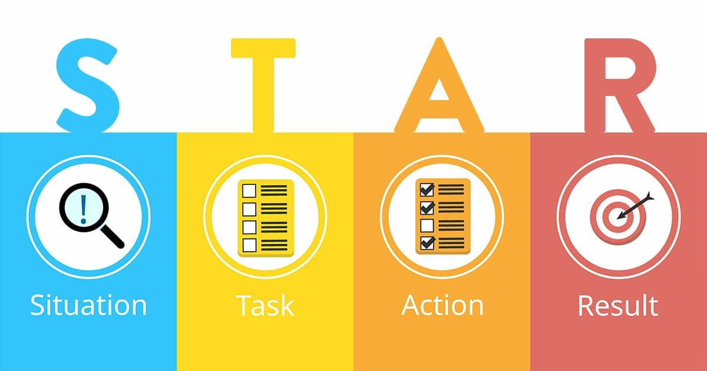

<h2>Have Backbone; Disagree and Commit<h2> 

•Leaders are obligated to respectfully challenge decisions when they disagree, even when doing so is uncomfortable or exhausting. 
•Leaders have conviction and are tenacious. 
•They do not compromise for the sake of social cohesion. 
•When a decision is determined, they commit wholly.

**Situation:**
While serving as an Agile Project Manager | Scrum Master, I was working on expanding our e-commerce business by launching a new product line in the electronics sector. During a strategic planning meeting with my leadership team, a majority of the team pushed for a costly marketing campaign focused entirely on social media influencers. I disagreed with this approach, as our data indicated that a more diversified marketing strategy across different platforms, including search engine optimization (SEO) and email marketing, would yield better returns. However, challenging the team's decision created tension.

**Task:**
I had to respectfully challenge the team's decision, present data-backed insights to support my position, and ultimately commit to the final direction of the campaign, regardless of the outcome. It was important to ensure that our decision would benefit the company's long-term goals, while also fostering team cohesion and trust in leadership.

**Action:**
I voiced my concerns in a respectful but firm manner, presenting data from our previous campaigns, which showed a higher conversion rate through a multi-channel strategy, not just social media. I emphasized the importance of diversifying our marketing efforts to reduce risks and maximize the overall reach. While the discussion became uncomfortable as I was the only one pushing back, I stood my ground, knowing that this was in the best interest of the business.

After thorough discussion and review of the data, the team still favored the social media-focused approach. At this point, despite my disagreement, I committed to the decision fully. I ensured that the team had my full support in executing the strategy and promised to give it every chance to succeed.

**Result:**
Although I initially disagreed, I worked closely with the team to execute the campaign. Over the following months, while the influencer-driven approach generated some visibility, the expected conversion rates were not met. However, because of my earlier data presentation, the team was more open to integrating the SEO and email marketing strategies. Ultimately, we adapted the plan, leading to a 40% increase in customer acquisition and a 15% rise in sales, confirming the effectiveness of a diversified marketing strategy. My willingness to disagree respectfully, and later fully commit to the team's decision, reinforced trust and collaboration within the team.