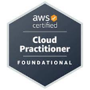

## JOURNAL ENTRY ZERO: STEPS
 **My 5yr Professional Forecast**
   
1.  In 6 months from now I would like to be working as an AWS Solutions Architect - Associate with a base salary of £45000 - £60000/yr. 
Create a structured study plan: Identify the AWS Certified Solutions Architect - Associate exam objectives and allocate time for studying each topic.
Gain hands-on experience: Build and deploy AWS solutions using free tier accounts or practice environments to solidify your understanding of AWS services and their applications.
Network with professionals: Connect with other AWS enthusiasts, attend meetups, and participate in online communities to learn from experienced professionals and get career advice.
Practice and prepare for the exam: Take practice exams to assess your knowledge and identify areas for improvement. Review the exam objectives and study materials to ensure you are well-prepared.

2 years from now I would like to be  an AWS Certified Solutions Architect - Professional | Machine Learning Engineer - Associate with a base salary of £65000 - £90000/yr.

5 years from now I would like to be an AWS Certified Machine learning Specialty | Cloud Consultant with a base salary of £95000 - £200000/yr.

**What to Learn in 5yrs**
1. In 6 months from now I would deepen my understanding of Serverless Computing(Lambda), Content Delivery Networks (CloudFront), Storage Solutions Networks (Simple Storage Services)(S3), Databases (DynamoDB), Authentication and Authorization (Cognito).
 
 2 years from now I would possess a deep understanding of complex AWS System Design, Security and Compliance, Hybrid and Multi-Cloud Enviroments, Automation and DevOps, Performace Optimization, Cost Optimization, Business Continuity and Disaster Recovery.
 
 5 years from now I would possess a deep understanding of ML Algorithms, Model Evaluation, Data Preprocessing, Amazon SageMaker, Amazon Rekognition, Amazon Comprehend, Amazon Forecast, Personalize, 
 
 Transcribe and Polly, Data Engineering and Infrastructure, Machine Learning Lifecycle, MLOps, and Business Understanding (Problem Framing, Metrics and Cost Optimization).

 ##### One Thing I could do better is Time management, and the qualities I admire in other people are Commitment, Courage, Focus, Openness and Respect.

#### NB: Markdown is a lightweight markup language that is used for formatting elements to plaintext document. 

1. **What would you like to be doing?** 
*6 months from now*
*2 years from now*
*5 years from now*

1. **What would you like to learn?**
*within 6 months*
*within 2 years*
*within 5 years*

1. One thing that you could do better is  _______________ (fill in the blank).

1. What qualities do you admire in other people?
----

