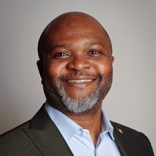

### WHO AM I QUESTIONNAIRE      

#### I'm Osita Nduka

### Some of the things I like to do are:

##### Swimming and Jogging: 
I enjoy staying active and keeping fit. These activities help me maintain a balanced and healthy lifestyle.
##### Meditation: 
I practice meditation regularly to stay centered and focused. It’s a great way to clear my mind and manage stress.
#### Reading: 
I love to read, especially materials that expand my knowledge and understanding, whether it's about new technologies, business strategies, or global markets.

#### Cooking:

Cooking is my creative outlet; I love transforming simple ingredients into extraordinary dishes. Experimenting with new flavors and ingredients is my favorite hobby.

### I am really good at: 

##### 1. Agile Project Management:
I excel in managing projects using Agile methodologies. Whether it's Scrum, Kanban, or Lean, I can effectively lead teams through the entire project lifecycle, from planning and sprint execution to reviews and retrospectives. My ability to create and manage product backlogs, define clear goals, and facilitate communication between stakeholders and development teams ensures that projects are delivered efficiently and with high quality.

##### 2. Leadership and Team Management:
I'm highly skilled at leading and motivating teams. I create a positive and productive work environment where team members feel valued and empowered to contribute their best. My leadership style focuses on clear communication, support, and guidance, which helps in achieving operational excellence.

##### 3. Problem-Solving and Decision-Making:
One of my strongest skills is my ability to think critically and solve problems creatively. I approach challenges with a practical mindset, always looking for the most effective solutions. My decision-making is informed by thorough analysis and consideration of all variables, which has consistently led to successful outcomes in complex situations.

##### 4. Financial Management:
I have a strong grasp of financial aspects in business, including budgeting, financial analysis, and resource allocation. My experience in managing financial resources has enabled me to maintain profitability and optimize returns on projects and business operations. I'm also adept at fundraising and managing financial risks.

##### 5. Technical Proficiency:
In addition to my management skills, I'm technically proficient in front-end web development. I have hands-on experience with HTML, CSS, JavaScript, React, and other tools, which allows me to bridge the gap between technical and non-technical team members. My knowledge of AWS Cloud Infrastructure and DevOps pipelines further strengthens my ability to oversee complex projects with a technical component.

##### 6. Communication and Interpersonal Skills:
Communication is one of my core strengths. I can articulate technical concepts to non-technical audiences clearly and effectively, ensuring that everyone involved in a project understands the objectives and progress. My interpersonal skills help me build strong relationships with stakeholders, team members, and clients, fostering collaboration and trust.

#### If you ask other people, they would describe me as:

People often describe me as diligent, motivated, and highly resourceful. My colleagues appreciate my ability to foster positive work environments and drive teams towards operational excellence. They see me as someone who is not only committed to achieving goals but also adept at navigating challenges and adapting to changing conditions. Additionally, my strong decision-making skills and financial acumen are frequently highlighted by those I work with.

I am always looking for opportunities to grow and leverage my skills in new and exciting projects. If you're looking for someone who can bring a wealth of experience, a positive attitude, and a relentless drive to your team, I’m your person!

### Some of my skills are:

#### Project Management: 
I am highly organized with excellent time management skills, and I can efficiently manage heavy workloads, ensuring that projects are delivered on time, within budget, and within scope.
#### Agile Methodologies: 
I am well-versed in Agile methodologies like Scrum, Kanban, and Lean. I have experience in leading Scrum ceremonies and collaborating with cross-functional teams to achieve project goals.
#### Communication: 
My communication and interpersonal skills are top-notch, which allows me to work effectively with stakeholders, team members, and clients, ensuring that everyone is on the same page.
#### Technical Proficiency: 
I have a solid foundation in front-end web development, including HTML, CSS, JavaScript, and React. I am also knowledgeable in DevOps pipelines, AWS Cloud Infrastructure, and test-driven development.
#### Problem Solving: 
I am detail-oriented with a strong ability to solve problems practically and creatively, especially under pressure.

#### I'm very interested in:

##### 1. Technology and Web Development:   
I have a strong interest in technology, especially in the field of Cloud computing,(AWS Platform) and Web development. I'm driven by a passion for creating cutting-edge software solutions in the cloud. I'm constantly exploring new technologies to build scalable and efficient cloud-based systems. I love the challenge of architecting robust cloud infrastructure. I'm always eager to dive into complex problems and find innovative solutions through technology. I enjoy staying updated on the latest trends in front-end development, including new frameworks, tools, and best practices. The process of building responsive, user-friendly web applications fascinates me, and I’m always eager to learn more about advancements in this area.

##### 2. Leadership and Team Dynamics:
I am very interested in leadership strategies and how to create high-performing teams. Understanding what motivates individuals and how to align their personal goals with the team’s objectives is something I’m passionate about. I’m also interested in how different leadership styles can impact team morale and productivity.

##### 3. Renewable Energy and Sustainable Practices:
Given my background in renewable energy solutions, I have a strong interest in sustainable practices and the development of green technologies. I believe in the importance of transitioning to renewable energy sources, and I’m keen on exploring innovative solutions that can make this transition more efficient and widespread.

##### 4. Continuous Learning and Development:
I’m always eager to learn and grow, which is why I’m interested in ongoing education and professional development. Whether it’s through formal training, reading, or practical experience, I’m committed to expanding my knowledge and skills. I find great value in staying curious and open to new ideas, especially in the fast-paced world of technology and business.

##### 5. Global Markets and Financial Systems:
My interest in international law and financial markets stems from my academic background, and I continue to follow developments in these areas closely. I’m particularly interested in how global financial systems evolve and how legal frameworks adapt to changing economic landscapes.

##### 6. Agile Project Management:
I have a deep interest in Agile methodologies and how they can be applied to improve project outcomes. I’m constantly exploring new techniques and tools within the Agile framework to enhance efficiency, collaboration, and product quality. I’m particularly interested in how Agile principles can be adapted to different industries and team dynamics.

#### Some of the things I like to do, both for work and for fun, are:

##### For Work:
#####  Project Planning and Execution:

I enjoy the process of planning and executing projects, particularly within the Agile framework. Organizing sprints, setting clear goals, and seeing a project move from concept to completion is something that brings me a great deal of satisfaction.
##### Team Collaboration:

I love working with teams, fostering collaboration, and helping others succeed. Whether it’s through daily stand-ups, sprint reviews, or just offering support and guidance, I find great joy in being part of a productive and motivated team.
Problem-Solving:

Tackling complex problems and finding practical solutions is something I thrive on. Whether it’s a technical issue, a project management challenge, or a strategic decision, I enjoy diving into the details and working towards the best possible outcome.
##### Learning New Technologies:

I have a keen interest in staying up-to-date with the latest technologies, especially in web development and cloud infrastructure. Experimenting with new tools and frameworks keeps my skills sharp and my work innovative.
#### For Fun:
##### Swimming and Jogging:

For relaxation and fitness, I enjoy swimming and jogging. These activities help me stay physically active and mentally refreshed, providing a good balance to my work life.
Meditation:

I practice meditation regularly as a way to maintain focus and manage stress. It’s a quiet time where I can clear my mind, reflect, and recharge.
Reading:

I have a deep love for reading, whether it’s books, articles, or research papers. I’m particularly interested in subjects related to technology, leadership, and global markets, but I also enjoy diving into fiction or philosophy for a change of pace.
##### Exploring Sustainable Practices:

I’m passionate about renewable energy and sustainable living. In my free time, I enjoy exploring new ideas and technologies that contribute to a more sustainable world. This might include researching the latest in solar power innovations or understanding how different industries are adapting to environmental challenges.

##### I have had the following jobs (both work and volunteer positions):

#### Professional Positions:
##### Agile Project Manager | Scrum Master | Business Analyst

In this role, I have been responsible for leading teams using Agile methodologies, managing projects from planning to delivery, and ensuring clear communication between stakeholders and development teams. My focus has been on achieving project goals efficiently while fostering a collaborative and productive work environment.
##### Project Manager | Product Owner at Osita Oyiliagu Farms Ltd, Nigeria (Feb 2020 – Feb 2024)

I led teams in livestock breeding and feed production, ensuring high standards in quality control, financial management, and strategic planning. My role involved managing resources, optimizing operations, and building strong relationships with stakeholders, including investors and customers.
##### Director at Locked-On Energy Systems Ltd, Nigeria (Jan 1995 – Jul 2010)

As the founder and director of a renewable energy solutions business, I managed import processes for solar products, oversaw installations, and maintained high levels of client satisfaction. I expanded the business globally, catering to a diverse client base, including SMEs across multiple countries.
##### Electoral Registration Officer Canvasser | Polling Clerk at London Borough of Newham (May 2011 – Dec 2022)

In this position, I managed the distribution of electoral registration forms and coordinated with households to ensure accurate voter registration. I also set up polling stations and provided assistance during elections, showcasing my organizational skills and commitment to public service.
##### Delivery Officer at Royal Mail Group (Sep 2012 – Aug 2014)

My role involved managing delivery routes, optimizing schedules, and ensuring timely and efficient delivery of packages. I demonstrated strong problem-solving skills by navigating various challenges such as changes in routes and weather conditions.
#### Volunteer Positions:
##### Community Outreach Volunteer

I’ve been involved in community outreach programs, where I’ve used my communication and organizational skills to assist in local initiatives, including voter registration drives and public awareness campaigns. This work allowed me to give back to my community and support causes I’m passionate about.
Youth Mentor

I volunteered as a mentor for young people, offering guidance on career choices, educational paths, and personal development. This role has been incredibly rewarding as it allowed me to make a positive impact on the lives of young individuals, helping them navigate their future with confidence.

#### I found my previous jobs most interesting when I was:

##### 1. Agile Project Manager | Scrum Master | Business Analyst
Most Interesting Aspect: What fascinated me most in this role was the dynamic nature of Agile methodologies. I found it incredibly engaging to adapt quickly to changes, facilitate effective communication among diverse teams, and see how iterative processes could lead to continuous improvement. The challenge of balancing scope, time, and budget while still delivering a high-quality product was both stimulating and rewarding.
##### 2. Project Manager | Product Owner at Osita Oyiliagu Farms Ltd, Nigeria
Most Interesting Aspect: Leading operations in the agricultural sector was particularly intriguing because of the constant need to innovate and adapt to market conditions. I was deeply interested in the intersection of traditional farming practices and modern management techniques. The opportunity to directly influence product quality and operational efficiency while building a sustainable business model was a compelling challenge.
##### 3. Director at Locked-On Energy Systems Ltd, Nigeria
Most Interesting Aspect: The renewable energy sector itself was a source of great interest. I was passionate about the potential of solar energy to transform how we power our lives sustainably. The global nature of the business also fascinated me—expanding operations across different countries and navigating the complexities of international trade and client relations provided valuable lessons in global business management.
##### 4. Electoral Registration Officer Canvasser | Polling Clerk at London Borough of Newham
Most Interesting Aspect: I found the civic responsibility and direct impact on the democratic process to be incredibly fulfilling. The most interesting part of this job was engaging with a diverse community and ensuring that every eligible voter had the opportunity to participate in the electoral process. I enjoyed the organizational challenge of setting up polling stations and coordinating with various stakeholders to ensure smooth and fair elections.
5. Delivery Officer at Royal Mail Group
Most Interesting Aspect: The logistical aspect of managing deliveries under various conditions was what I found most intriguing. I enjoyed optimizing delivery routes and schedules to ensure efficiency, and I took pride in overcoming the daily challenges that came with changes in weather, traffic, and customer needs. The role taught me a lot about time management and problem-solving on the go.
#### Volunteer Roles:
##### Community Outreach Volunteer

Most Interesting Aspect: The ability to directly contribute to community betterment and see the immediate impact of my efforts was incredibly rewarding. I particularly enjoyed the grassroots nature of the work, whether it was organizing voter registration drives or raising awareness on important issues. Engaging with the community on a personal level gave me valuable insights into public service and civic engagement.
Youth Mentor

Most Interesting Aspect: What I found most interesting in this role was the opportunity to influence and guide young minds at crucial stages of their development. Mentoring allowed me to share my experiences and knowledge, helping young people navigate their own paths with confidence. The personal connections I made and the growth I witnessed in the individuals I mentored were the most fulfilling aspects of this experience.